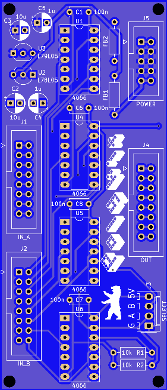

# Polykit Multiplexer 16:8

This repository contains schematics and PCB layout of a 2x8 to 8 channel multiplexer. It can be used to switch between different waveforms of a polyphonic oscillator. It is based on four 4066 bilateral switches and can handle a 10Vpp signal. It is powered by +-12V Eurorack style power supply.

## References

https://www.ti.com/lit/ds/symlink/cd4066b.pdf
